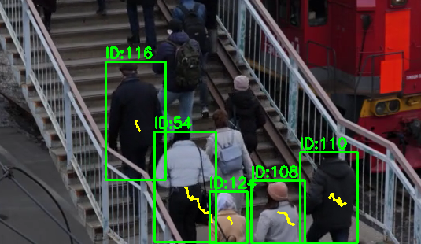

# ByteTrack Java

这是 ByteTrack 的 Java 实现，核心模块保持原版逻辑，包括三阶段 Track 管理、8D Kalman Filter、匈牙利匹配等。

## Demo

<p align="center">
  
</p>


## 算法实现对比

| 模块 / 功能           | 原版 ByteTrack                                               | 当前 Java 实现                    | 差异 / 影响          |
| ----------------- | ---------------------------------------------------------- | ------------------------------ | ---------------- |
| **Track 管理**      | 三阶段：Tentative → Active → Lost；hitStreak 达到阈值激活，lost 超过阈值删除 | 完全相同三阶段逻辑                      | 核心逻辑一致           |
| **Kalman Filter** | 8D `[x, y, a, h, vx, vy, va, vh]`，F/H/P/Q/R 矩阵             | 同样 8D KF，F/H/P/Q/R 矩阵一致        | 一致               |
| **IOU 匹配**        | 用矩形 IOU 计算匹配代价                                             | 同样使用矩形 IOU                     | 一致               |
| **匈牙利匹配**         | 使用成熟库/linear_sum_assignment                                | 自实现匈牙利算法                       | 算法结果一致，但性能可能略低   |
| **高置信度匹配**        | 匹配后更新 KF，hitStreak++，状态激活                                  | 相同逻辑                           | 一致               |
| **低置信度匹配**        | Tentative Track 更新，classId + gating                        | 更新策略略不同（只匹配 classId + low IOU） | 对追踪精度影响较小，但策略略简化 |


## 官方原版实现 JNI WAPPER

```java
// 对应的 JAVA 接口
package com.example.bytetrack;

import java.util.List;

public class ByteTrackJni {
    static {
        System.loadLibrary("bytetrack"); // libbytetrack.so
    }

    public native void initTracker(int fps, int trackBuffer);

    public native List<float[]> updateTracker(float[] detections, float[] probs);

    public native void releaseTracker();
}

// 创建 JNI 跟踪器（注意：非多线程安全）
ByteTrackJni tracker = new ByteTrackJni();

// fps：视频帧率（用于卡尔曼滤波预测）
// trackBuffer：目标丢失多少帧后删除轨迹
tracker.initTracker(30, 30);

// 每帧检测结果目标边框（xywh、xywh、xywh...）
// 注意这里输入的是非归一化后的像素坐标
float[] dets = {
    x1, y1, w1, h1,
    x2, y2, w2, h2
};

// 每个目标的置信度
float[] probs = { 0.9f, 0.8f };

// 输出跟踪 id、置信度、边框（xywh）
List<float[]> tracks = tracker.updateTracker(dets, probs);

for (float[] t : tracks) {
    int trackId = (int) t[0]; // 跟踪 ID
    float prob = t[1];        // 置信度
    float x = t[2], y = t[3], w = t[4], h = t[5]; // 边框
}

// 销毁跟踪器
tracker.releaseTracker();
